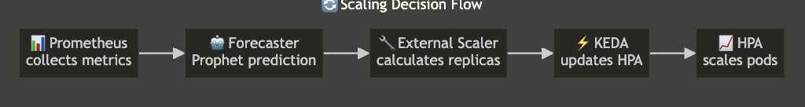

# KEDA ML Autoscaler

> 🚀 **Predictive autoscaling system for chat applications using machine learning-based forecasting with KEDA on Kubernetes**

[](https://opensource.org/licenses/MIT)
[](https://www.docker.com/)
[](https://kubernetes.io/)
[](https://keda.sh/)

## ✨ Features

- 🔮 **ML-based Load Forecasting** - Prophet time-series prediction for proactive scaling
- ⚡ **Fast Scaling Response** - ~15-30 seconds scale up/down with optimized KEDA configuration
- 💬 **Real-time Chat Application** - WebSocket-based chat server with HTTP API
- 📊 **Comprehensive Monitoring** - Prometheus metrics with Grafana dashboards
- 🧪 **Multiple Load Testing Tools** - WebSocket and HTTP-based testing utilities
- 🐳 **Container Ready** - Docker Compose for local development, Kubernetes for production

## 🏗️ Architecture



The system consists of:
- **Chat Backend**: WebSocket-based chat server with Prometheus metrics
- **Redis**: Message queue and data store
- **Forecaster**: ML service using Prophet for time-series prediction
- **KEDA External Scaler**: gRPC service that interfaces with KEDA
- **Prometheus**: Metrics collection
- **Grafana**: Monitoring dashboard

## 🚀 Quick Start

### Prerequisites

- Docker and Docker Compose
- Kubernetes cluster (Minikube, Docker Desktop, or cloud provider)
- kubectl CLI
- Python 3.11+ (for local development)

### 🐳 Local Development with Docker Compose

```bash
# Build and run all services
docker-compose up --build

# Access services
# Chat Backend: http://localhost:8000
# Forecaster: http://localhost:8001
# Prometheus: http://localhost:9090
# Grafana: http://localhost:3000 (admin/admin)
```

### ☸️ Kubernetes Deployment

#### Local Kubernetes (Minikube/Docker Desktop/Kind)

```bash
# Make scripts executable and build images
chmod +x scripts/*.sh
./scripts/build.sh

# For Minikube: use minikube's docker daemon
eval $(minikube docker-env)
./scripts/build.sh

# Deploy to Kubernetes
./scripts/deploy.sh

# Check deployment status
kubectl get pods -n chat-autoscaler
```

#### Remote Kubernetes (Cloud Providers)

```bash
# Set your Docker registry
export DOCKER_REGISTRY="yourusername"
export IMAGE_TAG="latest"

# Build and push images
./scripts/push-images.sh

# Update K8s manifests and deploy
./scripts/update-k8s-images.sh
./scripts/deploy.sh
```

### 🧪 Load Testing

```bash
# Install dependencies
pip install -r load-test/requirements.txt

# HTTP-based load testing (recommended)
python load-test/http_load_test.py --pattern spike --host localhost --port 8000
python load-test/http_load_test.py --pattern gradual --host localhost --port 8000

# WebSocket-based load testing
python load-test/load_test.py --pattern spike --base-clients 10 --spike-clients 50

# Locust load test (Web UI at http://localhost:8089)
locust -f load-test/locustfile.py --host http://localhost:8000
```

## 📊 Monitoring

### Prometheus Metrics

- `chat_messages_total` - Total messages processed
- `chat_active_connections` - Active WebSocket connections  
- `chat_messages_per_second` - Message rate
- `chat_message_latency_seconds` - Processing latency histogram

### Grafana Dashboard

Access at `http://localhost:3000` (credentials: admin/admin)

Dashboard includes:
- Messages per second
- Active connections
- Pod count
- Message latency percentiles
- CPU/Memory usage

## ⚙️ Configuration

### KEDA ScaledObject (Optimized for Fast Response)

```yaml
spec:
  minReplicaCount: 2
  maxReplicaCount: 20
  pollingInterval: 10        # Optimized from 30s to 10s
  cooldownPeriod: 30         # Optimized from 60s to 30s
  triggers:
  - type: external
    metadata:
      scalerAddress: keda-external-scaler:6000
      targetValue: "5"       # Optimized from 10 to 5
```

### Forecasting Model

```python
Prophet(
    changepoint_prior_scale=0.05,
    seasonality_prior_scale=10.0,
    daily_seasonality=True,
    weekly_seasonality=True
)

# Optimized parameters:
MIN_TRAINING_POINTS = 10      # Reduced from 100 for faster training
training_interval_minutes = 10  # Reduced from 30 for more frequent retraining
```

## 🛠️ Development

### Make Commands

```bash
make help          # Show available commands
make build         # Build all Docker images
make run           # Run with Docker Compose
make deploy        # Deploy to Kubernetes
make load-test     # Run load tests
make clean         # Clean up Docker resources
```

### Building Individual Services

```bash
# Build backend
docker build -t chat-backend:latest ./backend

# Build forecaster
docker build -t forecaster:latest ./forecaster

# Build KEDA scaler
docker build -t keda-scaler:latest ./keda-scaler
```

## 🔧 Troubleshooting

### Check Service Health

```bash
# Backend health
curl http://localhost:8000/health

# Forecaster health
curl http://localhost:8001/health

# Check KEDA scaler logs
kubectl logs -f deployment/keda-external-scaler -n chat-autoscaler
```

### Debug Forecasting

```bash
# Get current forecast
curl -X POST http://localhost:8001/forecast \
  -H "Content-Type: application/json" \
  -d '{"metric_name": "chat_messages_per_second", "horizon_minutes": 10}'
```

### Common Issues

1. **KEDA not scaling**: Check if the external scaler is reachable and returning metrics
2. **No metrics in Prometheus**: Ensure services have the correct annotations for scraping
3. **Forecaster errors**: Check if enough historical data is available (minimum 10 points)
4. **WebSocket connection failures**: Verify Redis is running and accessible
5. **Uneven load distribution**: Use HTTP load testing instead of WebSocket for proper distribution

## 📈 Performance Optimizations

### Scaling Response Time Improvements (~15-30 seconds)

- **KEDA Configuration**: Reduced polling intervals and cooldown periods
- **External Scaler**: Optimized HTTP timeouts and metric calculations
- **Forecaster**: Reduced training requirements and retraining intervals
- **Backend**: Added background tasks for metric cleanup

### Load Testing Strategy

- **HTTP vs WebSocket**: HTTP requests distribute evenly across pods
- **Load Patterns**: Spike, gradual, and sustained load testing
- **Distribution Verification**: Monitor per-pod load distribution

## 🧹 Cleanup

```bash
# Remove Kubernetes deployment
./scripts/cleanup.sh

# Remove KEDA as well
./scripts/cleanup.sh --remove-keda

# Stop Docker Compose
docker-compose down -v
```

## 📚 Documentation

- [📁 Documentation Index](docs/README.md) - Complete documentation overview
- [🏗️ Architecture Details](docs/architecture/project.md) - System design and implementation
- [📖 Monitoring Guide](docs/guides/MONITORING_STATUS.md) - Monitoring stack configuration
- [🐳 Minikube Setup](docs/guides/MINIKUBE_MONITORING_GUIDE.md) - Development environment guide
- [☸️ Kubernetes Deployment](docs/deployment/kubernetes-deployment.md) - Deployment instructions

## 🏭 Production Considerations

### Infrastructure
- Use persistent volumes for Prometheus and Grafana data
- Configure proper resource limits and requests
- Set up proper TLS/SSL for WebSocket connections
- Configure authentication for Grafana

### Scaling & Performance
- Monitor model accuracy and retrain periodically
- Set up alerting for scaling events
- Use HPA as fallback for KEDA
- Monitor per-pod load distribution in production

## 📄 License

MIT License - see [LICENSE](LICENSE) file for details.

## 🤝 Contributing

1. Fork the repository
2. Create a feature branch
3. Make your changes
4. Add tests if applicable
5. Submit a pull request

## 💬 Support

For issues and questions, please open a GitHub issue.

---

**Built with ❤️ using KEDA, Kubernetes, and Machine Learning**